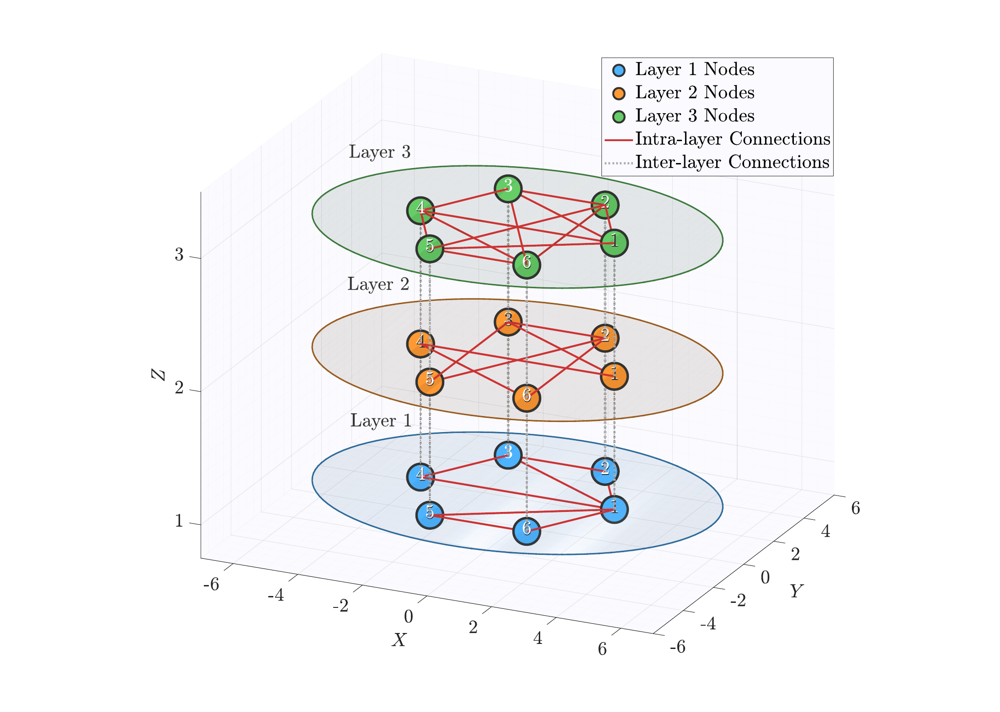
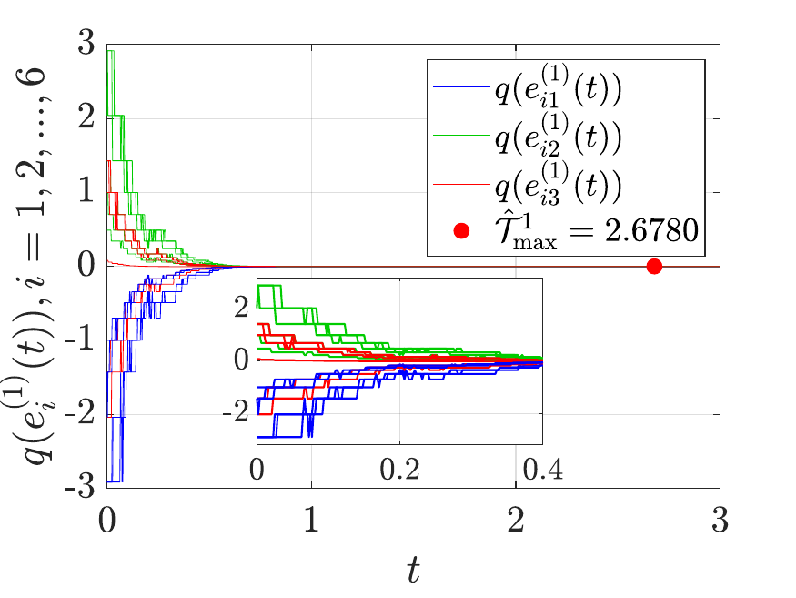
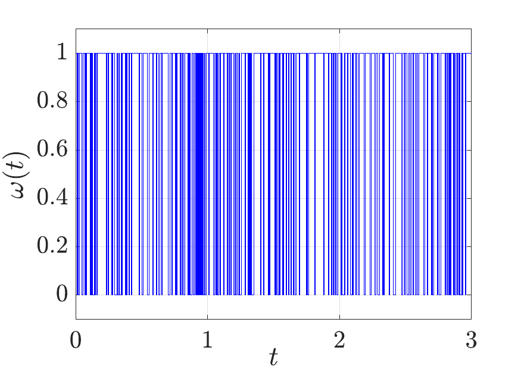
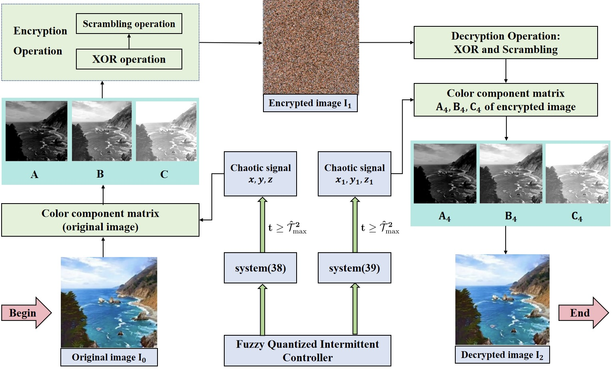

# Fuzzy Intermittent Quantized Control for Stochastic Multilayered Networks

MATLAB code and research figures accompanying:

> Y. Ding, S. Yang, W. Zhou, Y. Gao, and C. Hu, "Fuzzy intermittent quantized control for fixed/prescribed-time synchronization of stochastic multilayered networks subject to deception attacks," *Neurocomputing*, vol. 704, article 134849, 2026.  
> DOI: [10.1016/j.neucom.2026.134849](https://doi.org/10.1016/j.neucom.2026.134849)

This repository contains the author-provided MATLAB implementations used to study fixed-time and prescribed-time synchronization of stochastic multilayered networks with fuzzy intermittent quantized control and deception attacks. It also contains the source figure assets and selected PNG previews used in this README.

## Results at a glance









The previews are for navigation and visual inspection. The original vector and PDF figure files are in [`figures/source`](figures/source).

## Repository layout

```text
code/
  fixed-time/                  Fixed-time synchronization with attacks
  fixed-time-no-attack/        Fixed-time synchronization without attacks
  prescribed-time/              Prescribed-time synchronization with attacks
  prescribed-time-no-attack/   Prescribed-time synchronization without attacks
  attack-visualization/        Bernoulli deception-attack signal visualization
  chaotic-network/              Multilayer chaotic-network trajectory demo
  network-visualization/        3-D multilayer topology visualization
  quantizer-visualization/      Quantizer-level visualization
figures/
  preview/                     PNG/JPEG previews for the project page
  source/                      Author-provided EPS/PDF/JPEG/PNG figure assets
paper/
  README.md                    Citation and publisher-rights notice
```

## Requirements

- MATLAB R2024a or newer (older releases may work, but are not tested).
- MATLAB Statistics and Machine Learning Toolbox for `binornd`.
- MATLAB Communications Toolbox for `quantiz`.
- A graphics-capable MATLAB session for the plotting scripts.

The main simulations use fixed random seeds where reproducibility is important. They generate PDF figures in a simulation-results directory relative to the current MATLAB working directory.

## Quick start

From the repository root in MATLAB:

```matlab
addpath(genpath("code/fixed-time"));
multilayer_fuzzy_network_extended_adjacency2;
```

Other primary entry points are:

```matlab
addpath(genpath("code/fixed-time-no-attack"));
multilayer_fuzzy_network_no_attack2;

addpath(genpath("code/prescribed-time"));
multilayer_fuzzy_network_preassigned_time_sync;

addpath(genpath("code/prescribed-time-no-attack"));
multilayer_fuzzy_network_preassigned_time_no_attack;
```

The visualization utilities can be run independently:

```matlab
run("code/attack-visualization/attack_KSH.m");
run("code/network-visualization/dachuang_linjie1.m");
run("code/quantizer-visualization/dachuang_lianghua2.m");
addpath("code/chaotic-network");
multilayer_chaos_network_corrected;
```

The legacy `syn1_1.m` example uses MATLAB's deprecated `inline` API and is retained as supplied for archival reproducibility.

## Reproducibility notes

1. Start each simulation from the repository root so that generated result directories are easy to locate.
2. Run one experiment at a time; the scripts create figures and write PDF output files.
3. Do not add generated `simulation_results_*` folders to source control unless you intend to publish a new result set.
4. The code is a research artifact accompanying the cited paper, not a general-purpose toolbox. Parameters and model conventions should be checked against the paper before reuse.

## Citation

Please cite the paper when using this repository. A machine-readable citation is provided in [`CITATION.cff`](CITATION.cff).

```bibtex
@article{Ding2026Fuzzy,
  author  = {Ding, Yinhao and Yang, Shunyao and Zhou, Wangxiang and Gao, Yuhua and Hu, Cheng},
  title   = {Fuzzy intermittent quantized control for fixed/prescribed-time synchronization of stochastic multilayered networks subject to deception attacks},
  journal = {Neurocomputing},
  volume  = {704},
  pages   = {134849},
  year    = {2026},
  doi     = {10.1016/j.neucom.2026.134849}
}
```

## Licensing and paper access

The MATLAB source code in this repository is released under the MIT License. Figure assets are kept in a separate notice because some may be derived from the published article and may be subject to the publisher's rights; see [`figures/NOTICE.md`](figures/NOTICE.md).

The publisher version of the paper is intentionally not copied into this repository. Please use the DOI above for the version of record and consult [`paper/README.md`](paper/README.md) for the publication metadata and rights notice.

## Contact

For questions about the code or the research, please open a GitHub issue or contact the authors through the correspondence information on the published article.
